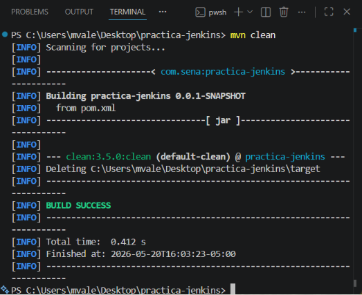
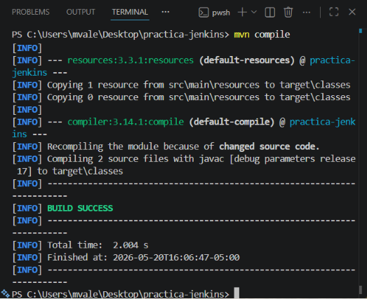
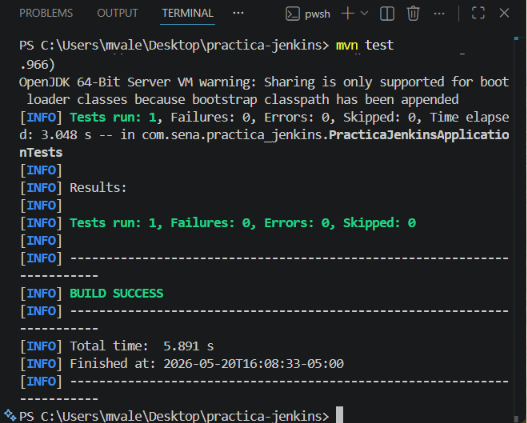
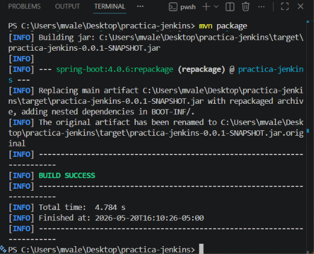
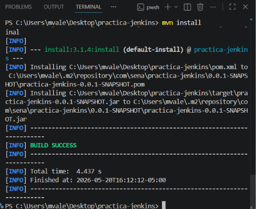

# Ejecución inicial proyecto maven 

## Comandos

```
mvn clean
```
Limpia el proyecto, se usa antes de compilar. 



```
mvn compile
```
Compila el proyecto, se usa durante el desarrollo.



```
mvn test
```
Ejecuta pruebas, se usa para validar cambios.



```
mvn package 
```
Genera el .jar, se usa antes de ejecutar/desplegar.



```
mvn install 
```
Instala en .m2, uso profesional/CI.



## Atajo

```
mvn clean install
```
Hace todo:
- clean
- compile
- test
- package
- install