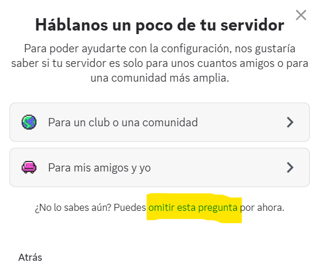
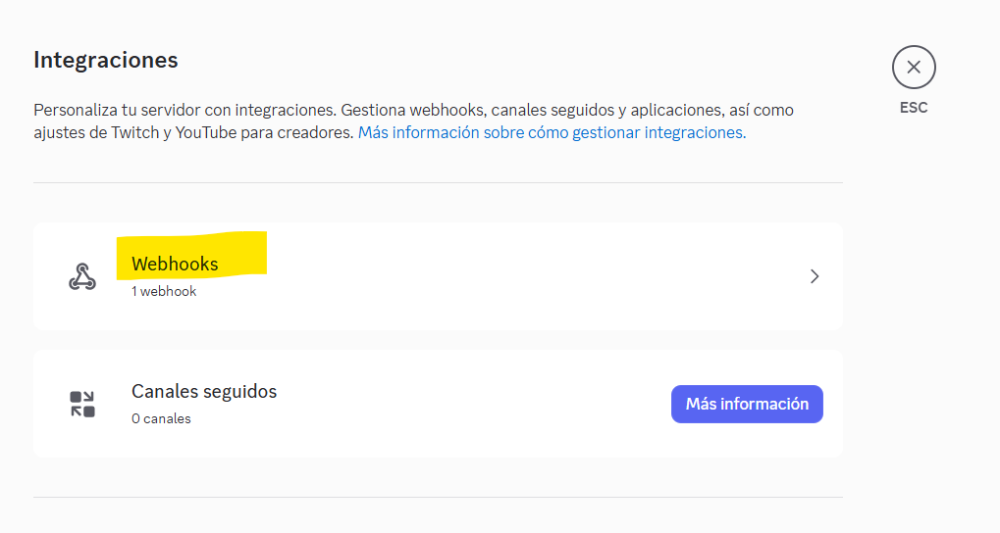
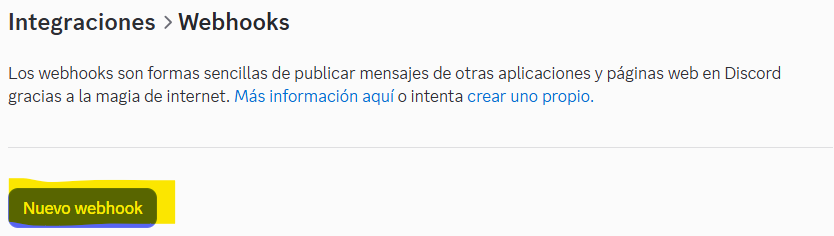

# Configuración de weebhooks

## Discord 

Crear un servidor 

Creamos nuestra plantilla

Omitimos pregunta

Asignamos un nombre y creamos

Nos iremos al servidor que creamos 

Podemos configurar nuestro webhook desde dos formas.

La primera es seleccionar el servidor y dirigirse a ajustes del servidor

Una vez allí debemos ir a la parte de aplicaciones e integraciones

Seleccionamos webhooks

y creamos uno

