# Configuración de weebhooks

## Discord 

Crear un servidor 

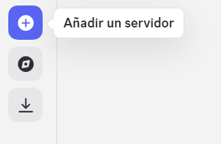

Creamos nuestra plantilla

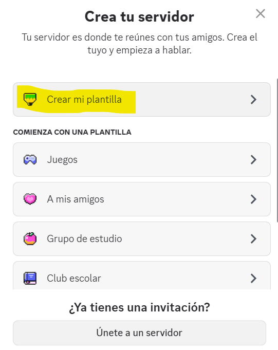

Omitimos pregunta


Asignamos un nombre y creamos

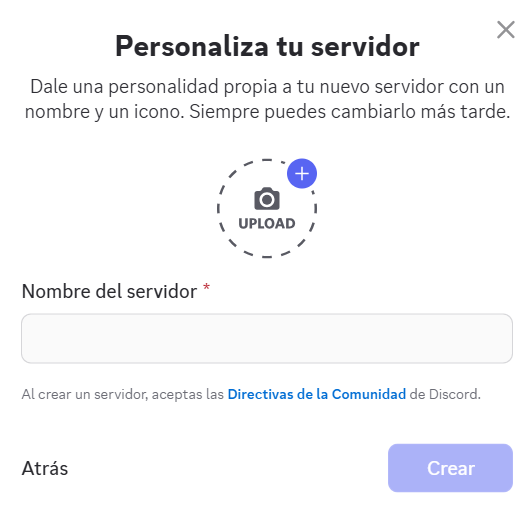

Nos iremos al servidor que creamos 

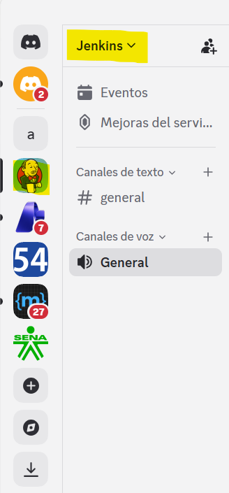

Seleccionamos el servidor y nos dirigimos a ajustes del servidor


Una vez allí debemos ir a la parte de aplicaciones e integraciones

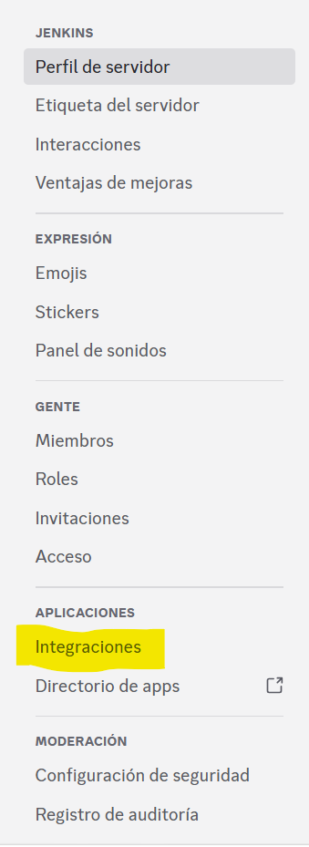

Seleccionamos webhooks


Y creamos uno


Nos generará uno así 

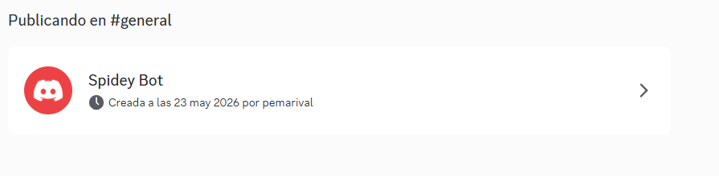

Lo importante acá es copiar la url 

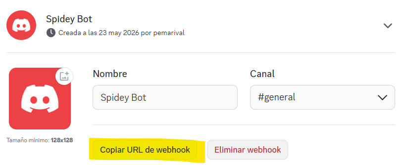

## Teams

Teams es muy limitado a funcionalidades y depende del tipo de cuenta con el que se ingrese, es por eso que en nuestro caso como primer paso debemos ingresar desde nuestra cuenta institucional soy.sena.edu.co

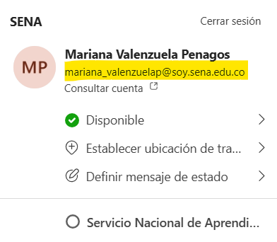

Después debemos dirigirnos a la sesión de equipos

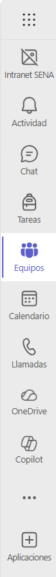

Al tener restricciones por parte de la organización no podremos crear un equipo

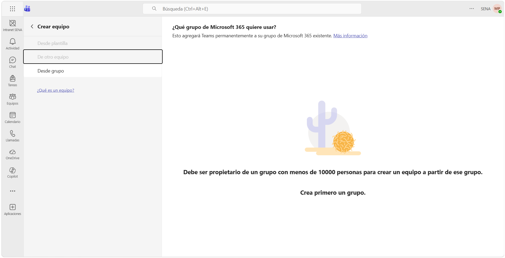

Pero si podemos unirnos a uno

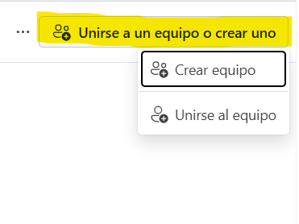

Nos aparecerá un listado grandísimo, podemos unirnos a cualquiera  

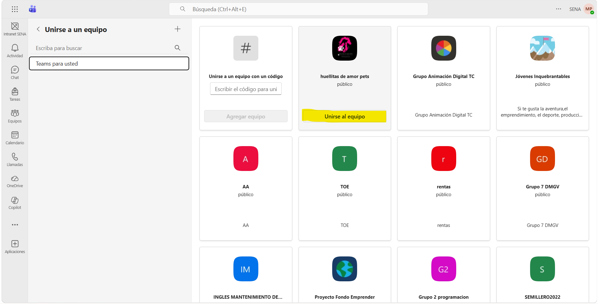

Una vez allí, debemos crear nuestro propio canal 

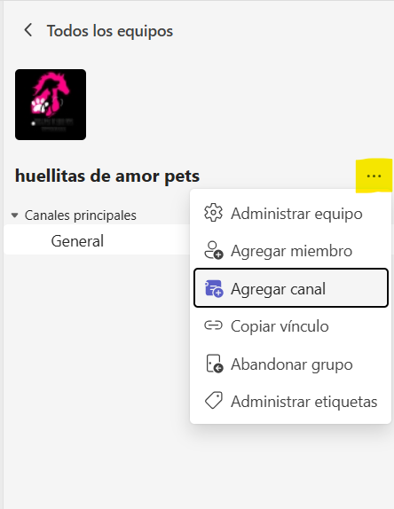

Asignamos nombre, la descripción es opcional y elegimos el tipo de canal, en mi caso seleccionaré privado porque no quiero que 265 miembros vean mi canal de pruebas

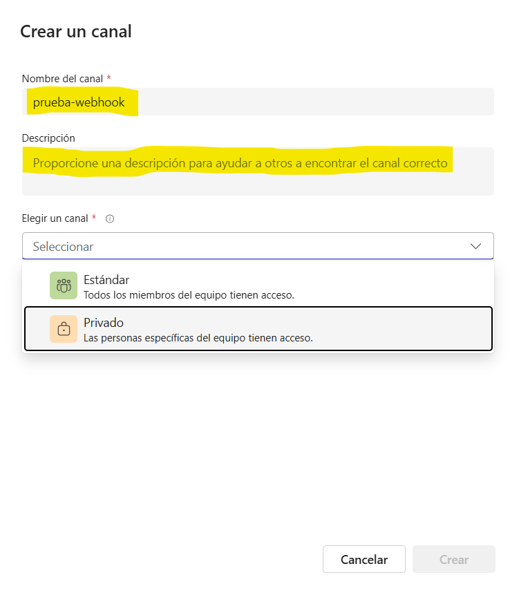

De igual manera omiteremos esta parte porque no es obligatorio hacerlo

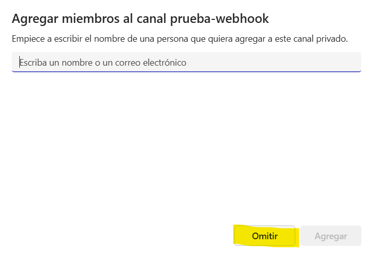

Ahora ya podremos ver que nuestro canal se creó, debemos dirigirnos a él y presionar los tres puntos y ir a flujos de trabajo

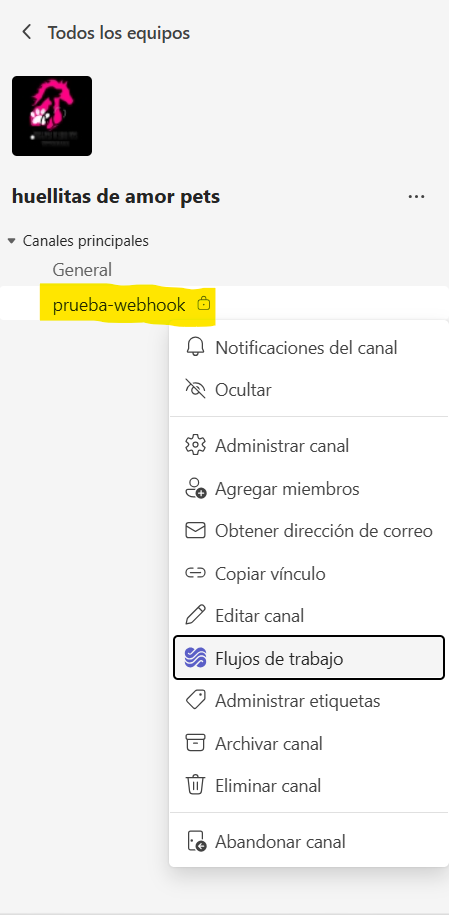

Deberemos seleccionar una plantilla 

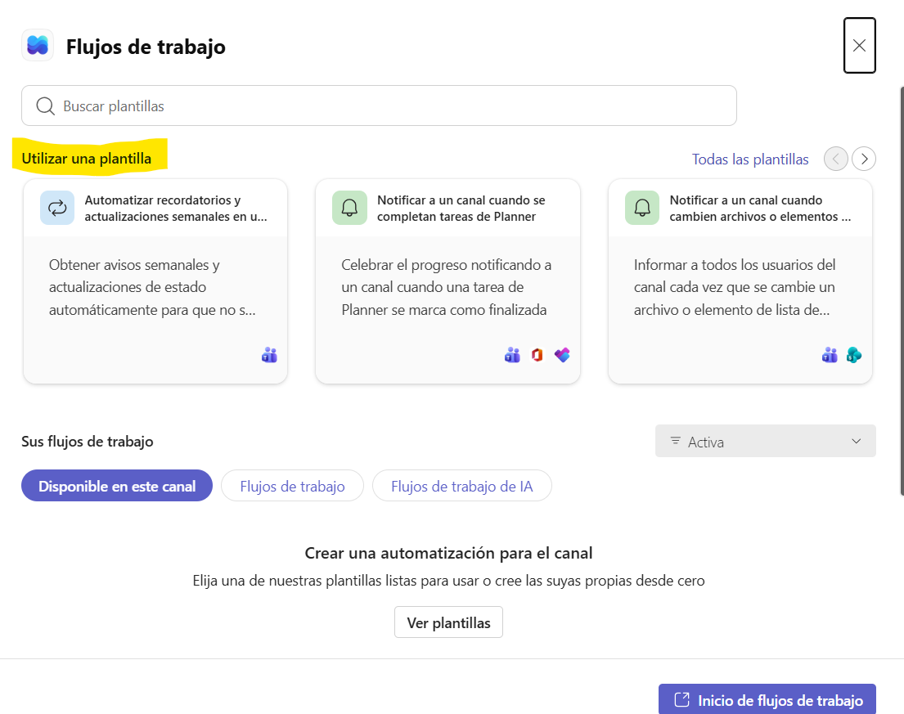

y escogeremos la siguiente

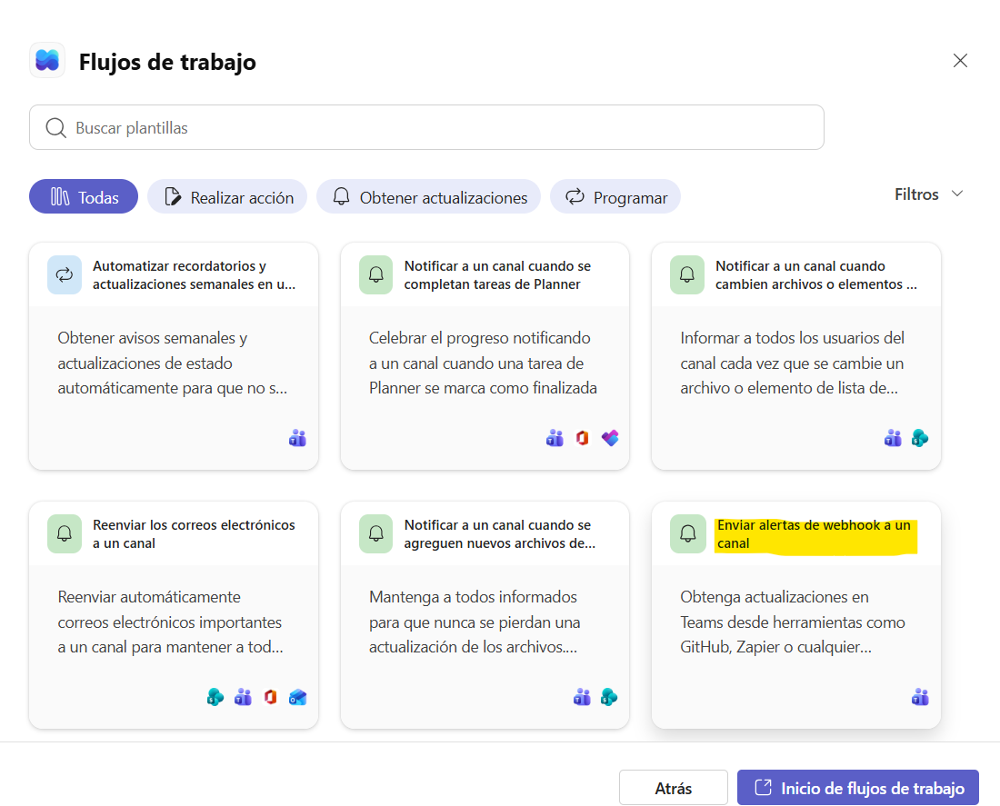

Configuramos el equipo, el canal y guardamos

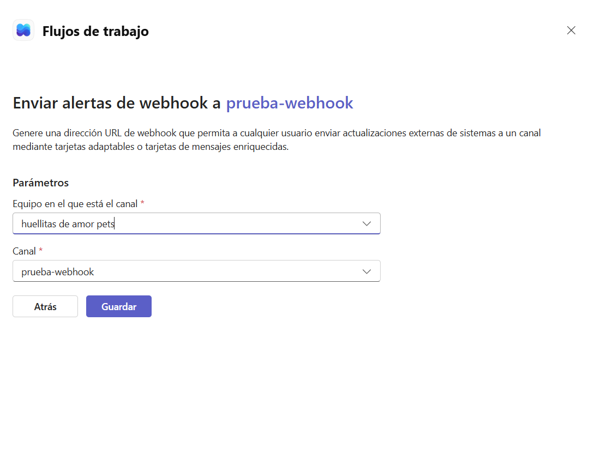

Y listo, ya tenemos nuestro webhook hecho

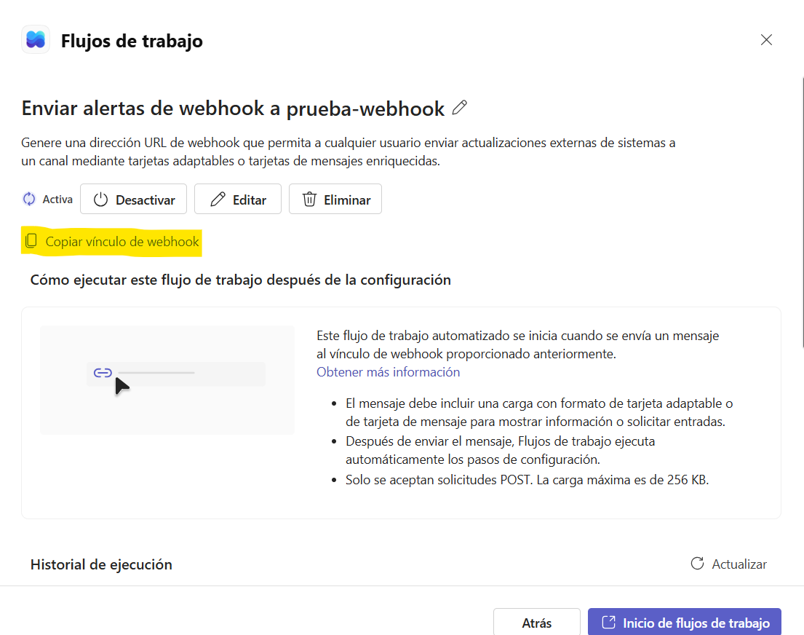

## Telegram

Ahora para telegram debemos buscar un bot llamado BotFather

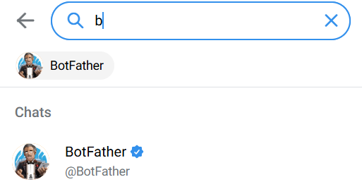

Le escribimos /start para empezar una charla con él

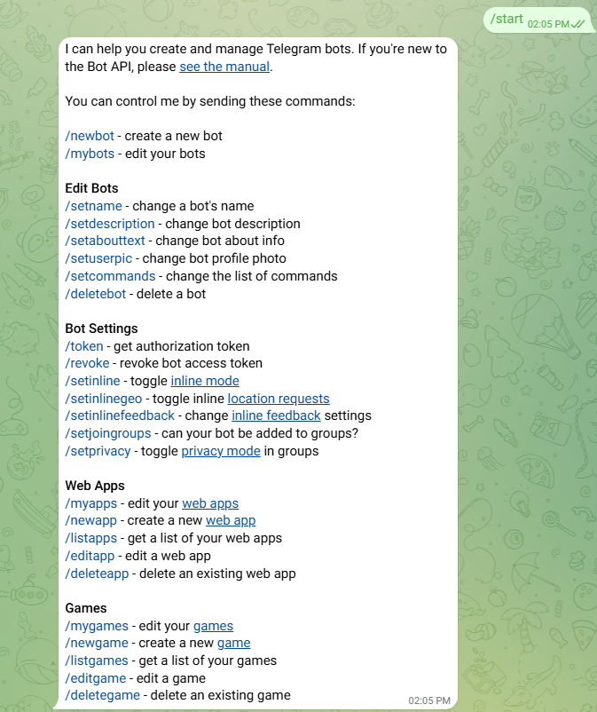

Creamos un nuevo bot, le asignamos nombre y el usuario

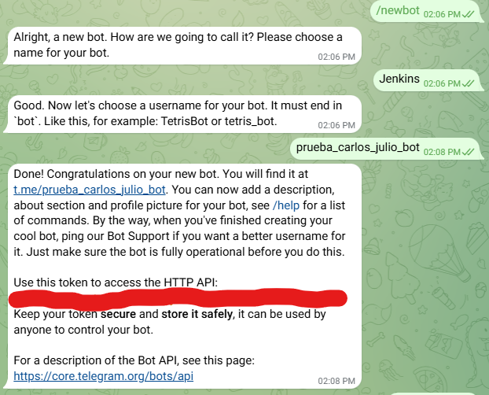

Ahora debemos buscar nuestro botsito

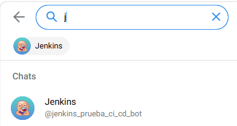

Debemos si o si generar una charla porque necesitamos el id 

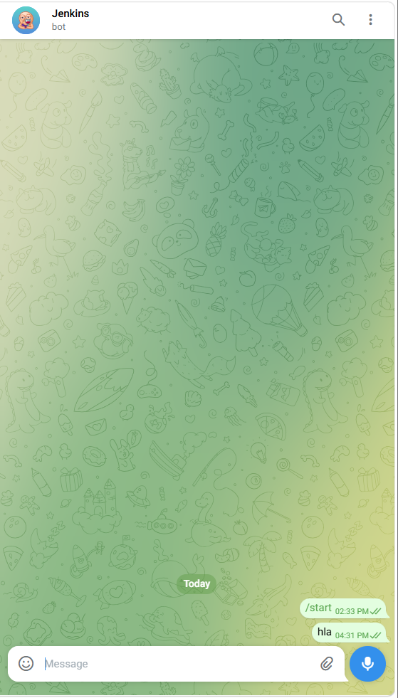

una vez echo esto, copiaremos este enlace con nuestro token de bot

```
https://api.telegram.org/bot[TOKEN_PERSONAL]/getUpdates
```
Nos saldrá algo así 

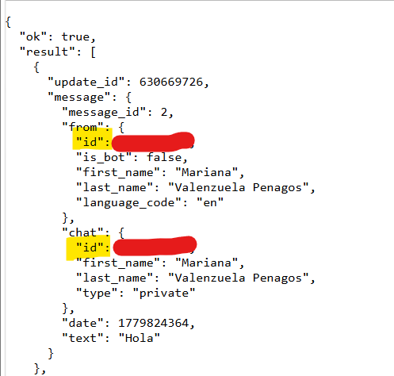


